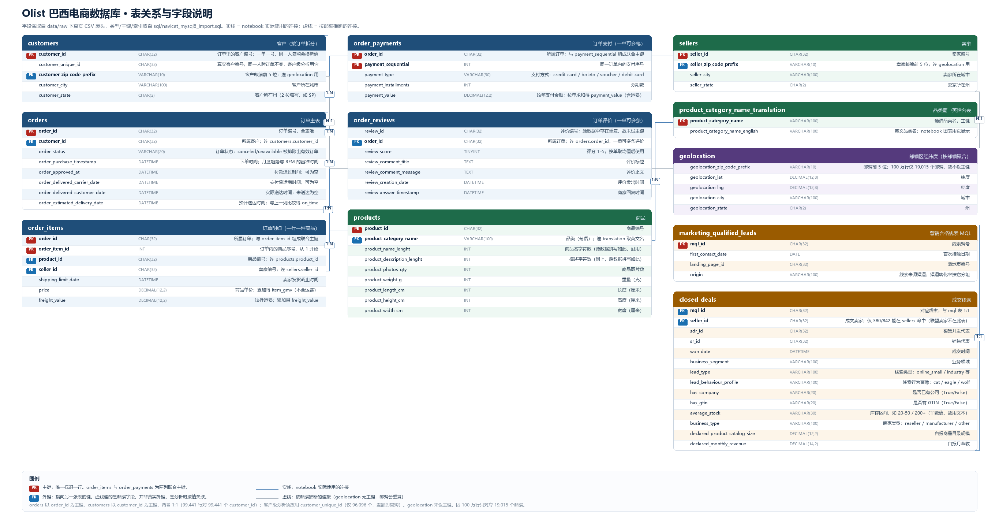

# Olist 电商数据分析项目

## 项目简介

本项目基于 Olist 巴西电商公开数据，使用 MySQL、Python、Pandas、Matplotlib 和 Pyecharts，完成用户、订单、商品、卖家、支付、评价及营销漏斗数据的清洗、分析与可视化。

项目采用 Jupyter Notebook 作为主要分析载体，便于按单元格逐步执行、调整参数和复用分析代码。

## 数据来源

- [Olist Brazilian E-Commerce Public Dataset](https://www.kaggle.com/datasets/olistbr/brazilian-ecommerce)
- [Marketing Funnel by Olist](https://www.kaggle.com/datasets/olistbr/marketing-funnel-olist)

主要数据表：

`customers`、`orders`、`order_items`、`order_payments`、`order_reviews`、`products`、`sellers`、`geolocation`、`product_category_translation`、`marketing_qualified_leads`、`closed_deals`。

### 表关系图



上图为 11 张表的完整关系与字段说明（SVG 矢量版见 [`docs/olist_erd.svg`](docs/olist_erd.svg)）。
图中标注了每张表的主键、外键以及每个字段的中文含义。

几点容易踩的坑，图上也有标注：

- `orders.customer_id` 与 `customers.customer_id` 是 **1:1**（99,441 行对 99,441 个 `customer_id`），
  即每笔订单单独分配一个客户编号；要按「人」统计必须用 `customer_unique_id`（仅 96,096 个，差额即复购）。
- `geolocation` **没有主键**：100 万行只对应 19,015 个邮编，同一邮编有多个坐标。
  客户邮编与它的匹配率约 99.0%，属于按值推断的连接，不是数据库层的外键。
- `order_reviews` 对 `orders` 不是严格 1:1：99,224 条评价对应 98,673 个订单，所以代码里按订单取评分均值。
- `closed_deals.seller_id` 只有 380/842 能在 `sellers` 表命中（联盟卖家不在该表），因此不能把它当常规外键使用。

## 分析内容

Notebook 共 11 节，编号与内容一一对应：

| 节 | 内容 | 主要产出 |
| --- | --- | --- |
| 1 | 分析目标 | — |
| 2 | 连接数据库（SSH 隧道 / 直连） | `RAW`：11 张源表 |
| 3 | 数据清洗 | `DATA`、`CLEANING_AUDIT` |
| 4 | 指标构建 | `ANALYSIS` |
| 5 | 可视化函数 | 图表构造函数 |
| 6 | 月度趋势 | 月度订单数、商品销售额、客户数 |
| 7 | 商品品类分析 | Top N 品类（金额 / 件数 / 订单数） |
| 8 | 州域、客户地理分布与营销渠道 | 州域散点、地理分布散点、渠道转化率 |
| 9 | 履约分析与评分归因 | 迟到率、延迟分档与评分 |
| 10 | 中文字体与 Matplotlib 导出 | `notebooks/exports/*.png` |
| 11 | 客户 RFM 分群 | 分群汇总与明细 |
| 12 | 业务结论 | 关键发现汇总 |

### 关键字段口径

- `item_gmv`：商品销售额，只累计 `order_items.price`，**不含**运费；
- `payment_value`：订单实付金额，取自 `order_payments.payment_value`，**含**运费；
- `freight_value`：运费，来自 `order_items.freight_value`；
- `item_count`：商品件数，按 `order_items.order_item_id` 计数；
- 有效订单：`order_status` 不属于 `PARAMS["excluded_statuses"]` 的订单；
- 客户粒度：统一使用 `customer_unique_id`，因为 `customer_id` 会随订单变化；
- `is_late`：实际送达日期**按天**比较晚于预计送达日期（同日送达算准时）
  这是全项目统一的「迟到」口径，避免按时间戳比较把当天送达误判为迟到；
- `late_rate`：`is_late` 的均值，仅在两个送达相关日期都非空的订单上计算；
- `avg_delivery_days`：实际送达日期 − 下单日期，端到端履约时长；
- `late_review_drop`：准时订单平均评分 − 迟到订单平均评分。

### 核心发现：延迟与评分的非线性关系

| 相对预计送达 | 订单数 | 平均评分 | 差评率（≤2 星） |
| --- | --- | --- | --- |
| 准时 / 提前 | 89,943 | 4.29 | 9.3% |
| 迟到 1–3 天 | 1,856 | 3.29 | 32.2% |
| 迟到 4–7 天 | 1,756 | 2.10 | 67.7% |
| 迟到 8–14 天 | 1,452 | 1.68 | 80.0% |
| 迟到 15 天以上 | 1,345 | 1.72 | 78.3% |

迟到 1–3 天已损失约 1 分；**超过 4 天后评分跌破 2.1 且差评率见顶（约 80%）**，
继续拖延不再显著恶化。这意味着履约优化的收益是非线性的——把订单从「迟到 8 天」
拉回「准时」的评分收益，远大于把「迟到 15 天」压到「迟到 8 天」。

跨州与同州的差异同样明显：跨州订单迟到率 7.81%、平均运费 23.6 BRL；
同州迟到率 4.45%、平均运费 13.4 BRL。**跨州物流是主要瓶颈。**

## 技术栈

- MySQL 8.0：数据存储与查询
- Python：数据清洗、统计分析和可视化
- Pandas：数据处理
- Matplotlib：静态可视化
- Pyecharts：交互式可视化
- Jupyter Notebook：交互式分析环境
- SSH 隧道：安全连接云端 MySQL

## 项目结构

```text
olist-ecommerce-analysis/
├─ config/
│  ├─ application.yml        # 配置占位符（${VAR} / ${VAR:默认值}）
│  ├─ .env.example           # 可提交的配置模板
│  └─ .env                   # 本地真实连接配置，已被 .gitignore 排除
├─ data/
│  └─ raw/                   # Olist 原始 CSV（transactions / marketing）
├─ notebooks/
│  ├─ olist_analysis.ipynb   # 主分析 Notebook
│  └─ exports/               # Matplotlib 静态图导出目录
├─ sql/
│  └─ navicat_mysql8_import.sql   # 建表 + LOAD DATA 导入脚本
├─ tools/
│  └─ clean_notebook_outputs.py   # 提交前清空 notebook 输出
├─ requirements.txt          # Python 依赖
├─ .gitignore                # 排除 .env、.venv、原始数据等
└─ README.md
```

> **提交前先清空 notebook 输出。** 用 Jupyter/VS Code 跑过之后，`.ipynb` 会把图表、
> 表格和执行时间戳一起存进文件；报错 traceback 里还带着本机绝对路径，不适合入库。
> 提交前执行一次：
>
> ```bash
> python tools/clean_notebook_outputs.py
> ```

## 运行方式

1. 准备 Python 环境并安装依赖：

   ```bash
   pip install -r requirements.txt
   ```

   本项目在 Anaconda base 环境（Python 3.13）下验证通过。
   根目录的 `.venv` 仅安装了 `ipykernel`/`pip`，**缺少 pandas、pyecharts 等库，不要选作 kernel**。

2. 用 `sql/navicat_mysql8_import.sql` 建库建表并导入 CSV。
   注意：脚本中 `CREATE DATABASE` 的库名必须与 `config/.env` 的 `MYSQL_DATABASE` 保持一致。

3. 复制 `config/.env.example` 为 `config/.env`，填写 SSH 和 MySQL 连接信息。
   真实密码只放在 `.env`，不要写入 Notebook 或代码。

4. 使用 VS Code、PyCharm 或 Jupyter 打开 `notebooks/olist_analysis.ipynb`。

5. 按 Notebook 单元格顺序执行：第 2 节连接数据库 → 第 3 节清洗 → 第 4 节指标构建
   → 第 5 节可视化函数 → 第 6–10 节图表与 RFM → 第 11 节业务结论。

## 指标口径

- 商品销售额（`item_gmv`）：只累计订单明细中的商品金额 `order_items.price`，不含运费。
- 实付金额（`payment_value`）：订单支付表的 `payment_value` 合计，含运费。
- 运费（`freight_value`）：订单明细中的运费合计。
- 订单量（`valid_orders`）：按有效订单编号 `order_id` 去重统计。
- 客单价（`aov`）：`item_gmv` 除以有效订单数。
- 客户消费金额（`monetary`）：按 `customer_unique_id` 汇总其有效订单的 `payment_value`。
- 复购率（`repeat_rate`）：同一 `customer_unique_id` 下单 ≥ 2 次的比例。
- 准时率（`on_time_rate`）：实际送达日期 ≤ 预计送达日期；仅在两个日期都非空的订单子集上计算，
  否则未送达订单会被误判为「不准时」。实测 93.23%。
- RFM：以有效订单的最大下单日期加 1 天作为分析截止日。
- 线索转化率（`mql_conversion`）：成交线索数除以营销合格线索数，仅用于描述性分析。
- 迟到率（`late_rate`）：见上文「关键字段口径」，与 `on_time_rate` 互为补数。

## 项目限制

- Olist 数据为公开历史数据，不能代表当前真实业务状况。
- 部分订单存在取消、缺失评价或日期缺失，需要结合业务口径解释。
- 营销漏斗数据与交易数据缺少稳定、完整的用户级关联关系，不能用于严格广告 ROI、用户级广告归因或因果推断。
- RFM 分层属于客户运营分析方法，分位数和标签边界会受到样本时间范围及数据清洗规则影响。

### 已知的口径与数据边界（这些不是 bug，但会影响结论解读）

1. **月度趋势的首尾月份不完整，必须剔除后再看趋势。**
   数据集实际可用区间约为 2017-01 至 2018-08：

   | 月份 | 订单数 | 有下单的天数 |
   | --- | --- | --- |
   | 2016-09 | 2 | 2 |
   | 2016-10 | 293 | 8 |
   | 2016-12 | 1 | 1 |
   | 2018-09 | 1 | 1 |

   （2016-11 在订单表中没有记录。）把这几段画进折线会在首尾形成贴着 0 的断崖，
   容易被误读为业务崩盘。2017-11 的峰值（7,421 单 / 100.4 万 BRL）对应巴西黑五大促，
   属于季节性因素而非趋势变化。

2. **复购率仅 3.04%，RFM 的 F 维度在该数据上几乎没有区分度。**
   94,989 位客户中 92,102 位（96.96%）只下单 1 次，人均订单数 1.034。
   对这样的 `frequency` 做五分位分箱时，大量并列值会退化成按位置等分，
   即 `f_score` 基本不代表购买频次高低。

   因此本项目的 RFM 分群**主要依赖 R 与 M 两个维度**，`f_score` 仅用于维持 RFM 框架完整性；
   若重新设计，应把 F 改为二值特征（是否复购）或直接改用 R+M 二维分群。

3. **「迟到」按天比较，与按时间戳比较会有约 1.3 个百分点的差异。**
   预计送达日期在源数据中的时间部分恒为 `00:00:00`，若按时间戳严格比较，
   预计当天白天送达的订单会被判为迟到（迟到率约 8.1%）。本项目统一按天比较（迟到率约 6.8%），
   并在全流程复用同一口径，避免不同图表给出互相矛盾的数字。

## 项目成果

完成从 MySQL 数据读取、Python 清洗、指标构建、履约归因、用户 RFM 分层到
交互式可视化展示的完整流程，为商品运营、卖家管理、客户分层和履约服务优化提供数据支持。
